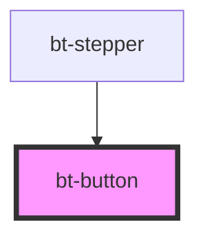

# bt-button

<!-- Auto Generated Below -->

## Properties

| Property   | Attribute  | Description                              | Type      | Default     |
| ---------- | ---------- | ---------------------------------------- | --------- | ----------- |
| `disabled` | `disabled` |                                          | `boolean` | `false`     |
| `loading`  | `loading`  | Properties for controlling button states | `boolean` | `false`     |
| `success`  | `success`  |                                          | `boolean` | `false`     |
| `validate` | `validate` |                                          | `boolean` | `undefined` |

## Events

| Event           | Description                              | Type                               |
| --------------- | ---------------------------------------- | ---------------------------------- |
| `btButtonClick` | Event emitted when the button is clicked | `CustomEvent<{ valid: boolean; }>` |

## Dependencies

### Used by

 - [bt-stepper](../bt-stepper)

### Graph

----------------------------------------------

*Built with [StencilJS](https://stenciljs.com/)*
