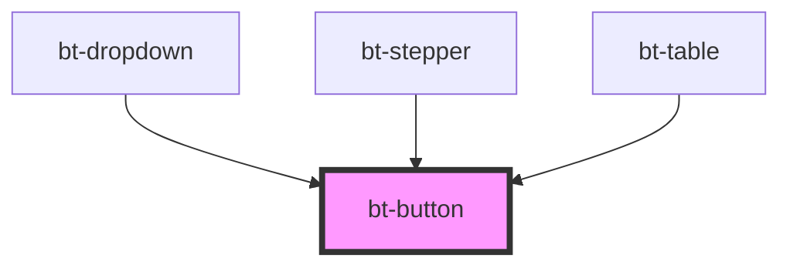

# bt-button


<!-- Auto Generated Below -->


## Usage

### Bt-button-usage

# How to Use `bt-button`

A simple example of how to use `bt-button`.
this component is imported from `bt-button/bt-button.tsx`
can be used in any component to create a button with the same styling

```html
<bt-button>Button</bt-button>
```


## Properties

| Property   | Attribute   | Description                              | Type      | Default     |
| ---------- | ----------- | ---------------------------------------- | --------- | ----------- |
| `disabled` | `disabled`  |                                          | `boolean` | `false`     |
| `hideText` | `hide-text` |                                          | `boolean` | `false`     |
| `loading`  | `loading`   | Properties for controlling button states | `boolean` | `false`     |
| `success`  | `success`   |                                          | `boolean` | `false`     |
| `validate` | `validate`  |                                          | `boolean` | `undefined` |


## Events

| Event           | Description                              | Type                               |
| --------------- | ---------------------------------------- | ---------------------------------- |
| `btButtonClick` | Event emitted when the button is clicked | `CustomEvent<{ valid: boolean; }>` |


## Dependencies

### Used by

 - [bt-dropdown](../bt-dropdown)
 - [bt-stepper](../bt-stepper)
 - [bt-table](../bt-table)

### Graph


----------------------------------------------

*Built with [StencilJS](https://stenciljs.com/)*
