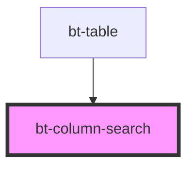

# bt-column-search

<!-- Auto Generated Below -->

## Properties

| Property | Attribute | Description | Type                                | Default    |
| -------- | --------- | ----------- | ----------------------------------- | ---------- |
| `type`   | `type`    |             | `"complex" \| "number" \| "string"` | `'string'` |

## Events

| Event          | Description | Type                  |
| -------------- | ----------- | --------------------- |
| `filterChange` |             | `CustomEvent<string>` |

## Dependencies

### Used by

 - [bt-table](../bt-table)

### Graph

----------------------------------------------

*Built with [StencilJS](https://stenciljs.com/)*
