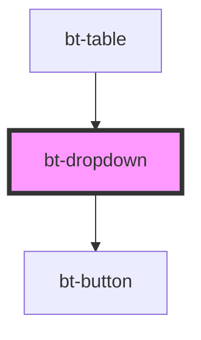

# bt-dropdown

<!-- Auto Generated Below -->

## Properties

| Property      | Attribute | Description | Type                      | Default    |
| ------------- | --------- | ----------- | ------------------------- | ---------- |
| `buttonProps` | --        |             | `{ [key: string]: any; }` | `{}`       |
| `options`     | --        |             | `{ [key: string]: any; }` | `{}`       |
| `x`           | `x`       |             | `"left" \| "right"`       | `'left'`   |
| `y`           | `y`       |             | `"bottom" \| "top"`       | `'bottom'` |

## Events

| Event    | Description | Type               |
| -------- | ----------- | ------------------ |
| `action` |             | `CustomEvent<any>` |

## Dependencies

### Used by

 - [bt-table](../bt-table)

### Depends on

- [bt-button](../bt-button)

### Graph

----------------------------------------------

*Built with [StencilJS](https://stenciljs.com/)*
