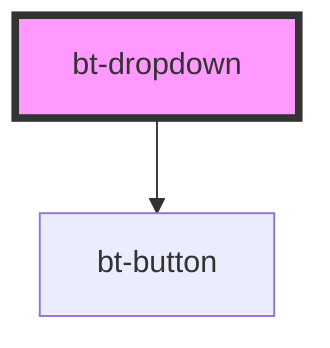

# bt-dropdown

<!-- Auto Generated Below -->

## Properties

| Property  | Attribute | Description | Type                      | Default |
| --------- | --------- | ----------- | ------------------------- | ------- |
| `options` | --        |             | `{ [key: string]: any; }` | `{}`    |

## Events

| Event            | Description | Type               |
| ---------------- | ----------- | ------------------ |
| `dropdownChange` |             | `CustomEvent<any>` |

## Dependencies

### Depends on

- [bt-button](../bt-button)

### Graph

----------------------------------------------

*Built with [StencilJS](https://stenciljs.com/)*
