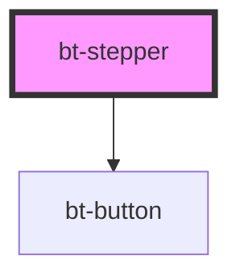

# bt-stepper

<!-- Auto Generated Below -->

## Methods

### `setStepValidity(index: number, isValid: boolean) => Promise<void>`

#### Parameters

| Name      | Type      | Description |
| --------- | --------- | ----------- |
| `index`   | `number`  |             |
| `isValid` | `boolean` |             |

#### Returns

Type: `Promise<void>`

## Dependencies

### Depends on

- [bt-button](../bt-button)

### Graph

----------------------------------------------

*Built with [StencilJS](https://stenciljs.com/)*
