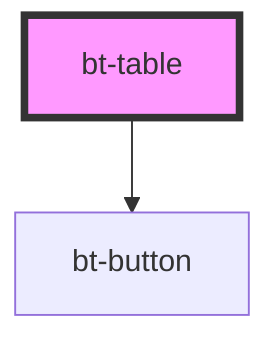

# bt-table

<!-- Auto Generated Below -->

## Properties

| Property    | Attribute    | Description | Type                                                                                            | Default                                                                                                                                                                                                                                                                                                                                                        |
| ----------- | ------------ | ----------- | ----------------------------------------------------------------------------------------------- | -------------------------------------------------------------------------------------------------------------------------------------------------------------------------------------------------------------------------------------------------------------------------------------------------------------------------------------------------------------- |
| `actions`   | --           |             | `{ [key: string]: (row: { [key: string]: any; }) => void; }`                                    | `{}`                                                                                                                                                                                                                                                                                                                                                           |
| `config`    | --           |             | `{ [key: string]: any; }`                                                                       | `{     caption: 'Data table',     next: 'Next',     prev: 'Previous',     emptyData: 'No data',     loading: 'Loading...',     error: 'Error',     pagesize: 'Rows per page',     page: 'Page',     rows: 'Rows',     select: 'Select',     selectall: 'Select all',     search: 'Search',     sort: 'Sort',     filter: 'Filter',     actions: 'Actions'   }` |
| `headers`   | --           |             | `{ key: string; label: string; sortable?: boolean; filterable?: boolean; action?: boolean; }[]` | `[]`                                                                                                                                                                                                                                                                                                                                                           |
| `isAsync`   | `is-async`   |             | `boolean`                                                                                       | `false`                                                                                                                                                                                                                                                                                                                                                        |
| `pageSize`  | `page-size`  |             | `number`                                                                                        | `5`                                                                                                                                                                                                                                                                                                                                                            |
| `rows`      | --           |             | `{ [key: string]: any; }[]`                                                                     | `[]`                                                                                                                                                                                                                                                                                                                                                           |
| `totalRows` | `total-rows` |             | `number`                                                                                        | `undefined`                                                                                                                                                                                                                                                                                                                                                    |

## Events

| Event        | Description | Type                                                             |
| ------------ | ----------- | ---------------------------------------------------------------- |
| `action`     |             | `CustomEvent<{ row: { [key: string]: any; }; action: string; }>` |
| `edit`       |             | `CustomEvent<{ row: { [key: string]: any; }; }>`                 |
| `filter`     |             | `CustomEvent<{ filters: { [key: string]: string; }; }>`          |
| `page-size`  |             | `CustomEvent<{ [key: string]: any; }>`                           |
| `pagination` |             | `CustomEvent<{ [key: string]: any; }>`                           |
| `search`     |             | `CustomEvent<{ searchText: string; }>`                           |
| `selection`  |             | `CustomEvent<{ [key: string]: any; }>`                           |
| `sort`       |             | `CustomEvent<{ key: string; direction: "desc" \| "asc"; }>`      |

## Methods

### `applyAsyncSearch() => Promise<any>`

Applies filters and sorting to the rows data based on the current search text,
column-specific filters, and sort configuration, but only if the table is in
async mode. If the table is not in async mode, it does nothing.

#### Returns

Type: `Promise<any>`

A promise that resolves to the filtered rows.

### `getAllSelectedRows() => Promise<{ [key: string]: any; }[]>`

Returns a promise that resolves to an array of all rows that are currently selected.
The promise resolves to an array of objects, where each object is a row in the table.

#### Returns

Type: `Promise<{ [key: string]: any; }[]>`

A promise that resolves to an array of all selected rows.

## Shadow Parts

| Part          | Description |
| ------------- | ----------- |
| `"heading-1"` |             |

## Dependencies

### Depends on

- [bt-button](../bt-button)

### Graph

----------------------------------------------

*Built with [StencilJS](https://stenciljs.com/)*
